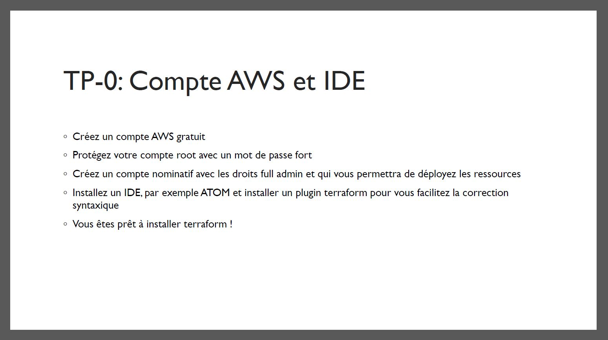
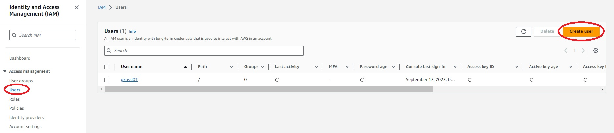
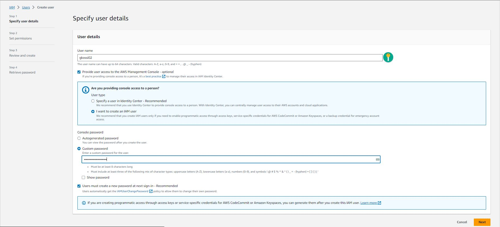
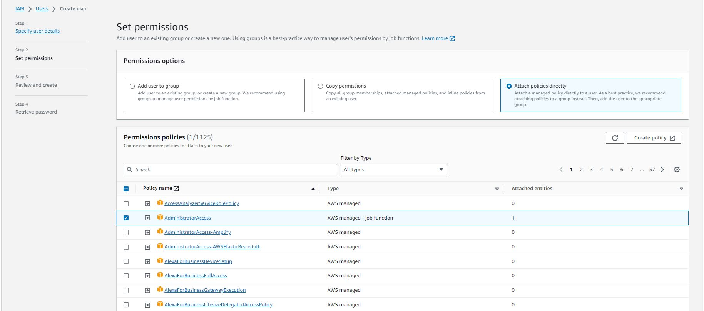
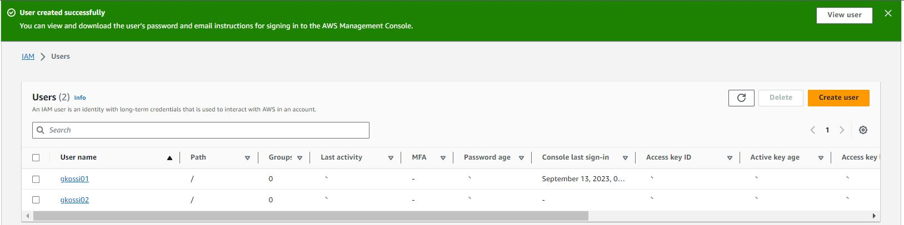
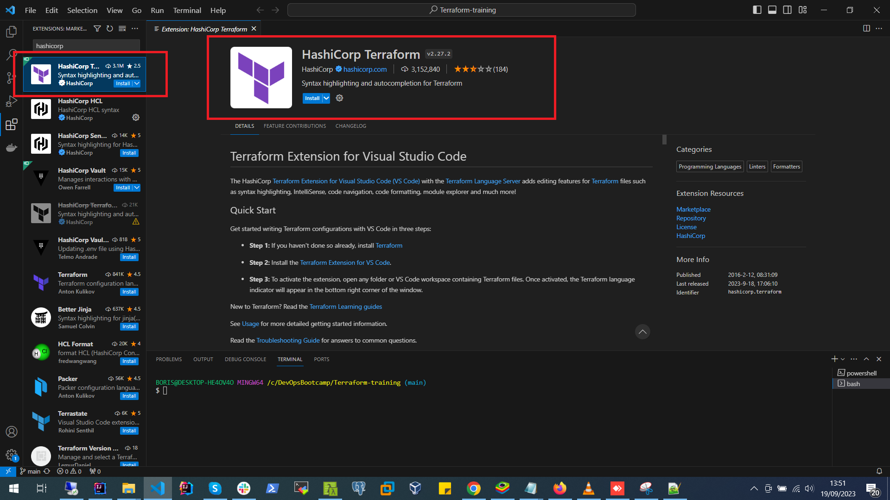

# TERRAFORM-TRAINING

# TP-0 : Compte AWS et IDE

> ![Compte AWS et IDE] 

- Créer un compte AWS gratuit
- Protégez votre compte root avec un mot de passe fort
- Créer un compte nominattif avec les droits full admin et qui vous permettra de déployer les ressources
- Installez un IDE, par exemple ATOM et installer un plugin terraform pour vous faciliter la correction syntaxique
- Vous etes pret à installer terraform !

# STEP BY STEP WORKING

On suppose que les deux premières étapes (***Etape1 et Etape2***) notamment la création de compte gratuit ainsi que la protection du compte root par un mot de passe fort ont été déjà réalisées

## Etape3 : Créer un compte nominattif avec les droits full admin et qui vous permettra de déployer les ressources
- Je me connecte avec le compte root
- Je Choisis le service IAM (Identity and Access Management)
- Je me rends sur le module **Access Management** et je clique sur l'onglet **Users**
- Ensuite, je clique sur le bouton **Create user** 
> ![1-create user] 

- Ensuite, je définis les détails spécifique de l'utilisateur
> ![2-specify details] 

- Ensuite, je définis les accès pour l'utilisateur (ici, je choisis **AdministratorAccess** pour permettre à mon utilisateur IAM d'avoir un accès total aux services et ressources)
> ![3-AdministratorAccess] 

- Ensuite, je valide 
> ![4-create user successfully] 

## Etape4 : Installez un IDE, par exemple ATOM et installer un plugin terraform pour vous faciliter la correction syntaxique
- Pour ce qui concerne l'IDE, moi je vais installer VS Code et ensuite installer le plugin HashiCorp Terraform
> ![5-VS Code + Hashicop Terraform] 