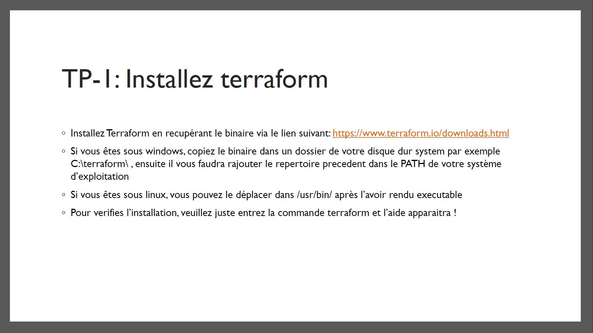
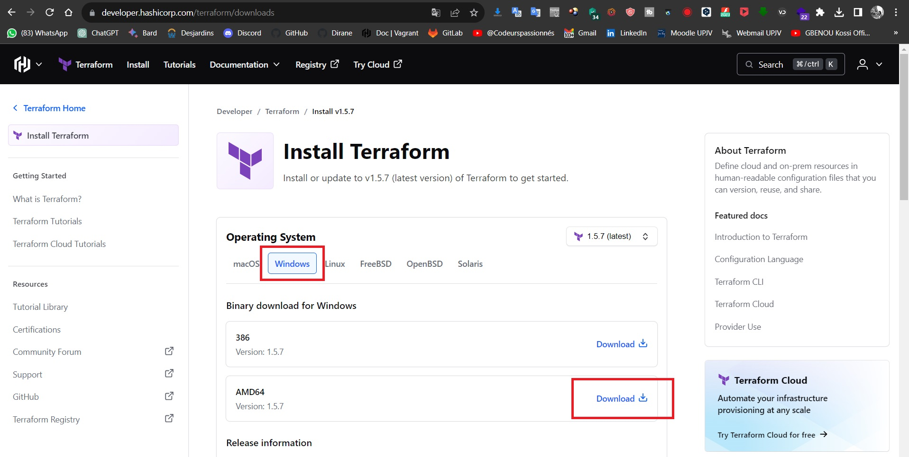
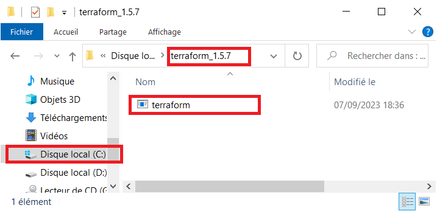
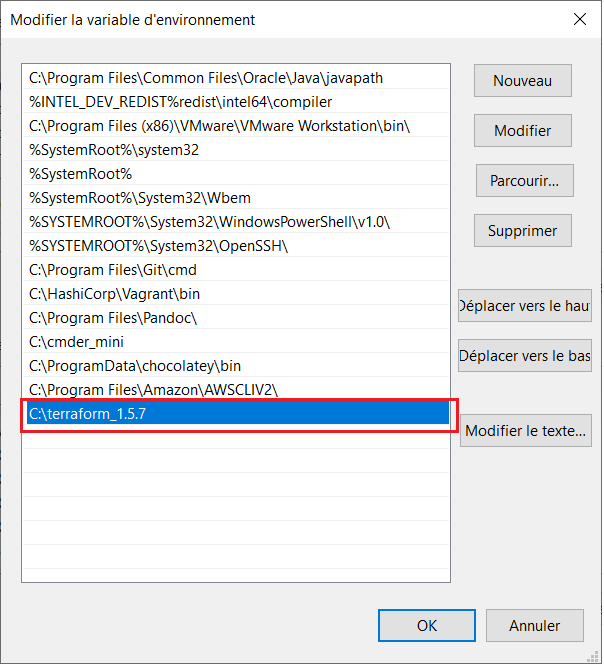
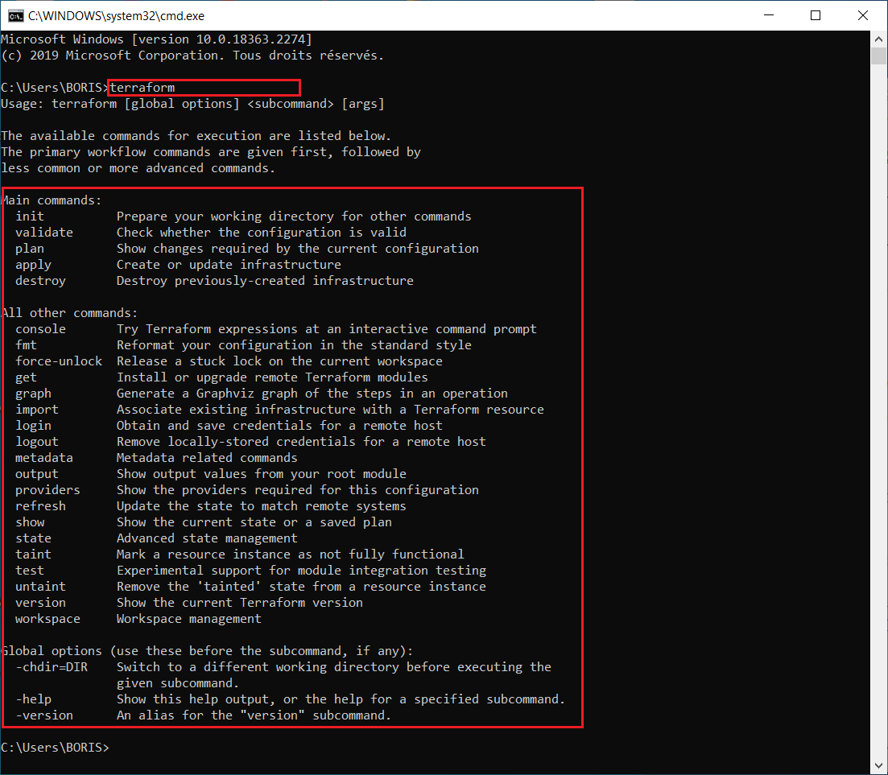

# TERRAFORM-TRAINING

# TP-1 : Installez terraform

> ![Installer Terraform] 

- Installer Terraform en récupérant le binaire via le lien suivant https://www.terraform.io/downloads.html ou https://developer.hashicorp.com/terraform/downloads
- Si vous etes sous windows, copiez le binaire dans le dossier de votre disque dur system par exemple C:\terraform\, ensuite il vous faudra rajouter le répertoire précédent dans le PATH de votre système d'exploitation
- Si vous etes sous linux, vous pouvez le déplacer dans /usr/bin/ après l'avoir rendu exécutable
- Pour vérifier l'installation, veuillez juste entrez la commande terraform et l'aide apparaitra !

# STEP BY STEP WORKING

ici, moi je suis entrain de travailler sous Windows

- Je récupère le binaire en ligne


- Ensuite, je le dézipe dans le dossier `C:\terraform_1.5.7\`


- Ensuite, je rajouter le répertoire `C:\terraform_1.5.7\` dans le PATH de votre système d'exploitation


- Et en fin, je peux vérifier l'installation :


# PROCEDURE D'INSTALLATION DE TERRAFORM SOUS CENTOS
```bash
# On va mettre à jour le système ainsi que la liste des dépots
sudo yum -y update && sudo yum -y upgrade

# On va installer les outils d'extraction de l'archive ainsi que l'outil permettant de télécharger l'archive
sudo yum install unzip wget

# On va récupérer la release que l'on souhaite
sudo wget https://releases.hashicorp.com/terraform/1.6.1/terraform_1.6.1_linux_amd64.zip

# On va désarchiver le fichier et l'envoyer dans le répertoire /usr/locla/bin
sudo unzip ./terraform_1.6.1_linux_amd64.zip -d /usr/local/bin

# On peut maintenant tester en exécutant la commande terraform
terraform
```