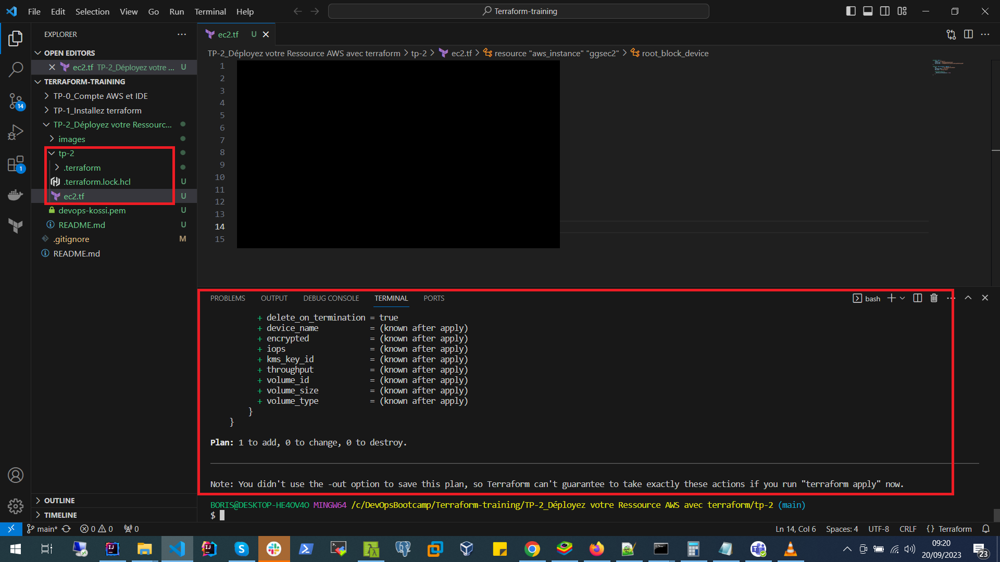
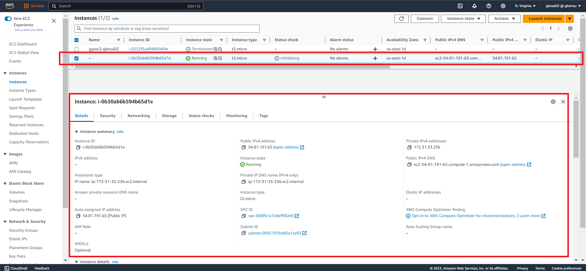
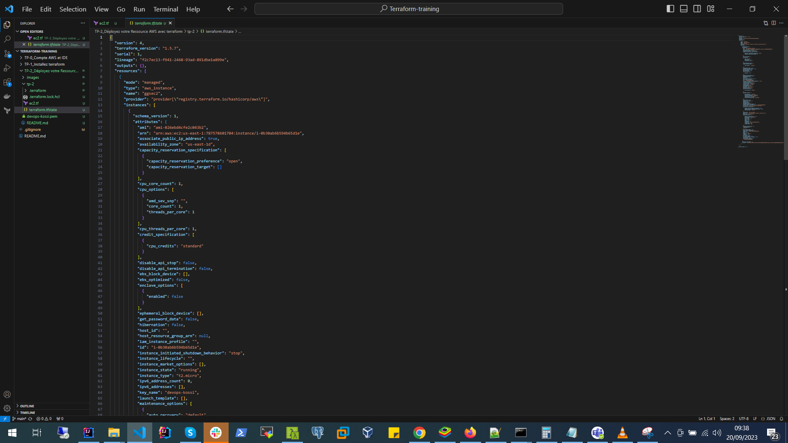
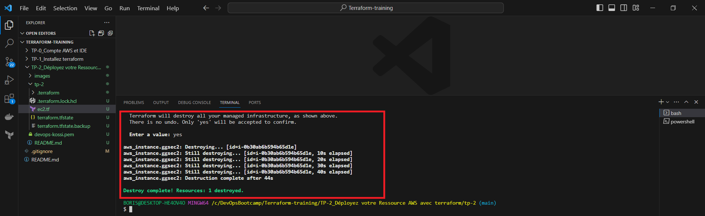

# TERRAFORM-TRAINING

# TP-2 : Déployez votre Ressource AWS avec terraform

- Récupérez le secret et access key de votre compte (dans les paramètres sécurité de votre compte dans IAM)
 
- Créez un paire de clé dans EC2 et nommez cette clé devops-<votre prenom>, un fichier devops-<votre prenom>.pem sera téléchargé (conservez la jalousement)
 
- Créez une fichier ec2.tf dans un répertoire nommé tp-2
 
- Renseignez les informations permettant de créer une VM avec l’image centos suivante: Red Hat Enterprise Linux 9 (HVM), SSD Volume Type (ami-026ebd4cfe2c043b2)
 
- ATTENTION nous travaillerons uniquement dans la region US East (N. Virginia)us-east-1 dans toute cette formation
 
- Vérifiez que votre instance est bien créée et observez le contenu de fichier tfstate
 
- Modifiez le fichier ec2.tf afin d’y inclure le tag de votre instance :"Name: ec2-<votre prenom>"
 
- Appliquez la modification et constatez les changement apportées ainsi que dans le fichier tfstate
 
- Supprimez votre ec2 

> ![Déployez votre ressource AWS avec Terraform] 


# STEP BY STEP WORKING

- **Récupérez le secret et access key de votre compte (dans les paramètres sécurité de votre compte dans IAM)**
> ![Récupération du secret et access key] 

- **Créez un paire de clé dans EC2 et nommez cette clé devops-<votre prenom>, un fichier devops-<votre prenom>.pem sera téléchargé (conservez la jalousement)**
> ![Création de la paire de clé dans EC2] 
 
- **Créez une fichier ec2.tf dans un répertoire nommé tp-2**
 
- **Renseignez les informations permettant de créer une VM avec l’image centos suivante: Red Hat Enterprise Linux 9 (HVM), SSD Volume Type (ami-026ebd4cfe2c043b2)**
> ![Fichier ec2.tf] 

# Code source du fichier manifeste
```bash
# Paramétrage du provider en l'occurrence "AWS"
provider "aws" {
    region = "us-east-1"
    access_key = "01234021mlk352XYDn,jtr"
    secret_key = "L510qkO6TwiZfiYww9i1112233441111100000014"
}

#Paramétrage de la ressource à déployer
resource "aws_instance" "ggsec2" {
    ami           = "ami-026ebd4cfe2c043b2"
    instance_type = "t2.micro" 
    key_name = "devops-kossi"

    tags = {
      Name = "ec2-gkossi02"
    }

    root_block_device {
      delete_on_termination = true
    }
}
```

> ![Résultat de la commande terraform-init] 

> ![Résultat de la commande terraform-plan] 

> ![Résultat de la commande terraform-apply] 

 - **Vérifiez que votre instance est bien créée et observez le contenu de fichier tfstate**
> ![Vérification de la création de l'instance sur AWS] 

> ![Vérification du contenu du fichier terraform.tfstate] 
 
- **Modifiez le fichier ec2.tf afin d’y inclure le tag de votre instance : “Name: ec2-<votre prenom>”**
> ![Ajout du tag au fichier ec2.tf] 

- **Appliquez la modification et constatez les changement apportées ainsi que dans le fichier tfstate**
> ![Vérification des modifications sur AWS] 

> ![Vérification du fichier terraform.tfstate] 

- **Supprimez votre ec2 **
> ![Résultat de la commande terraform-destroy] 

> ![Vérification de suppression sur AWS] 

