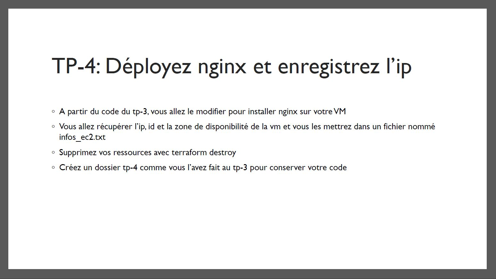
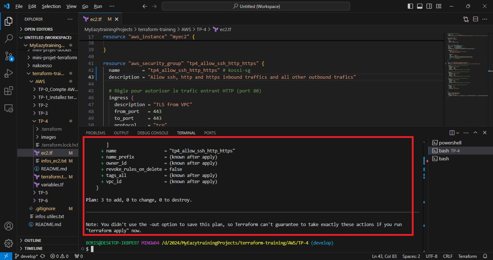
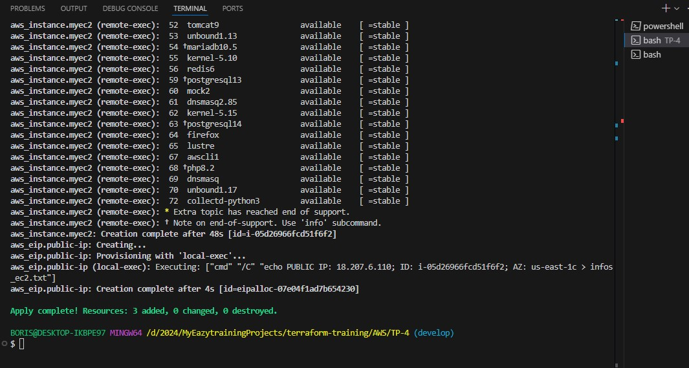
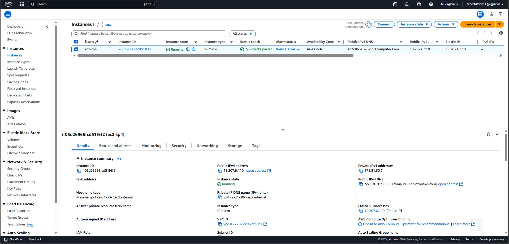
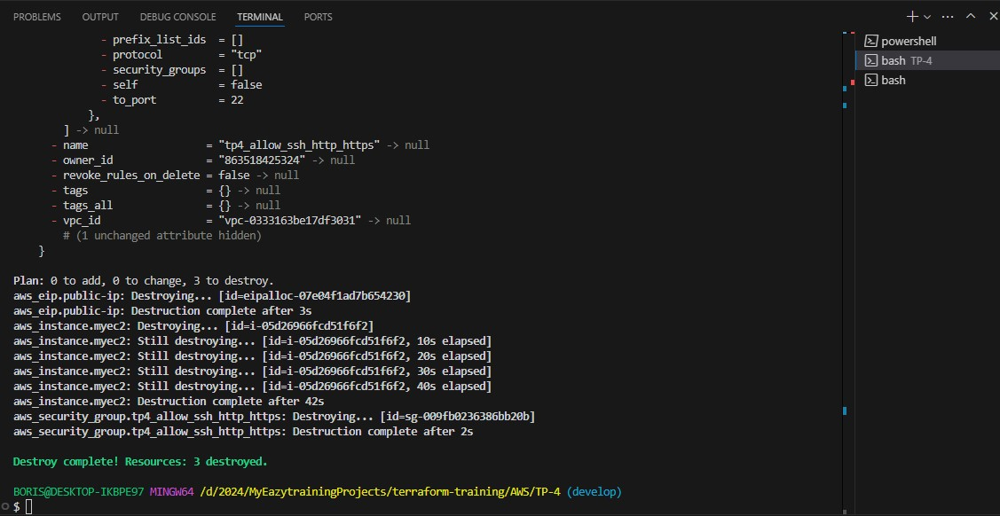

# TERRAFORM-TRAINING

# TP-4 : Déployez Nginx et enregistrer l'IP

> ![Déployez Nginx et enregistrer l'IP] 

# REALISATIONS

> ![Terraform plan] 

> ![Terraform apply] 

> ![Vérification sur la console AWS] 

> ![Vérification du fonctionnement du serveur nginx] 

> ![Terraform destroy] 

