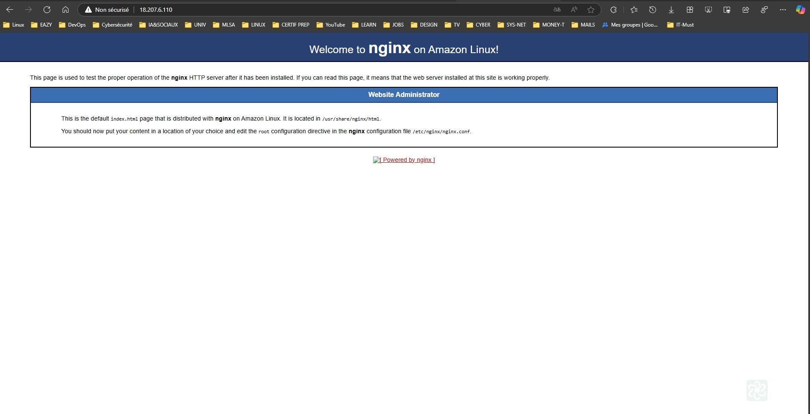

# TERRAFORM-TRAINING

# TP-4 : Déployez Nginx et enregistrer l'IP

> ![Déployez Nginx et enregistrer l'IP] 

# REALISATIONS

> ![Etape N°1 : Terraform plan] 

> ![Etape N°2 : Terraform apply] 

> ![Etape N°3 : Vérification de l'instance EC2 déployée sur la console AWS] 

> ![Etape N°4 : Vérification du fonctionnement du serveur nginx] 

> ![Etape N°5 : Terraform destroy] 

