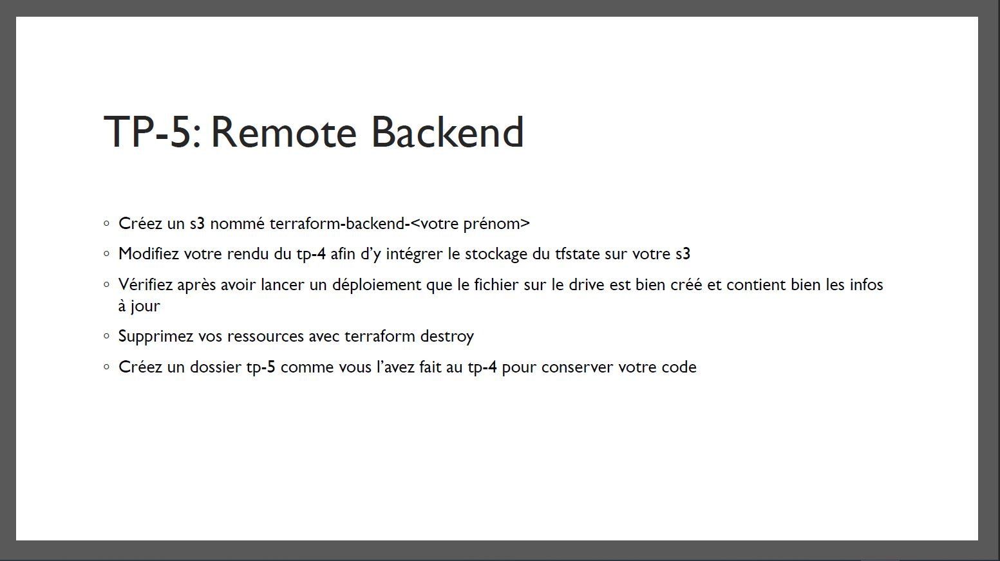
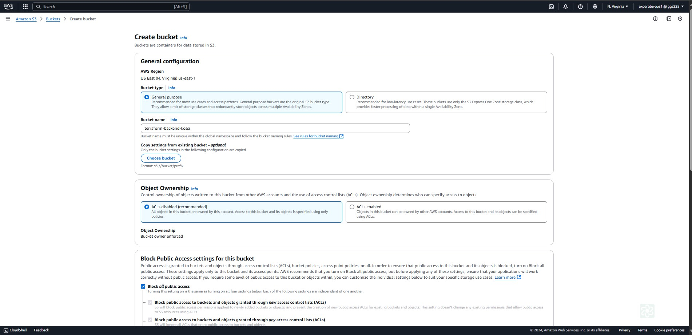
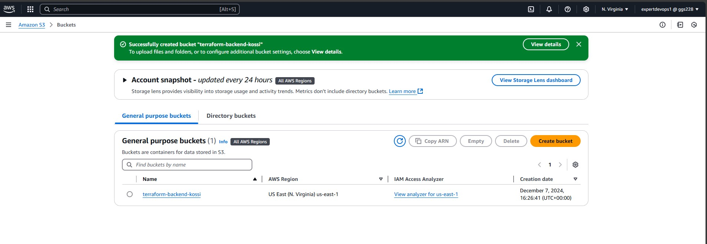
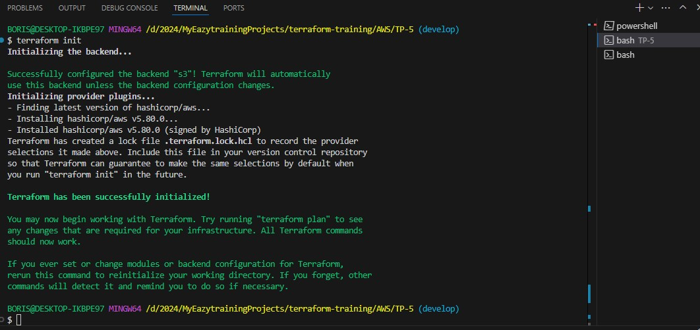
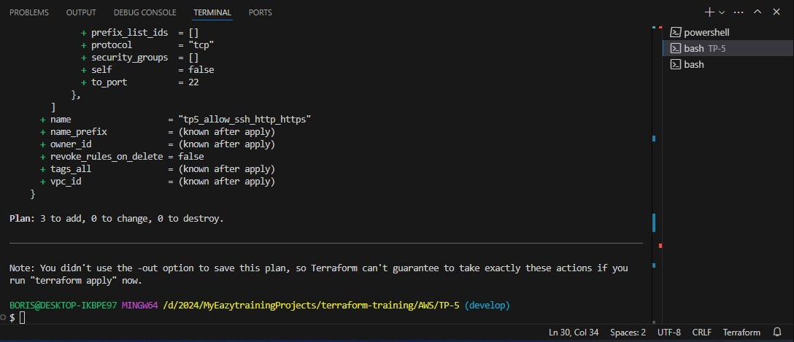
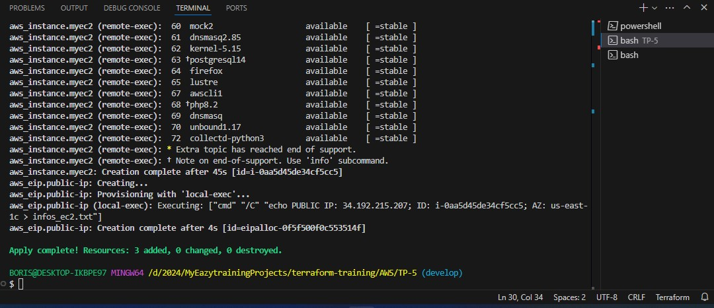
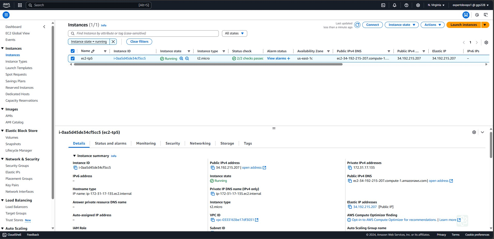
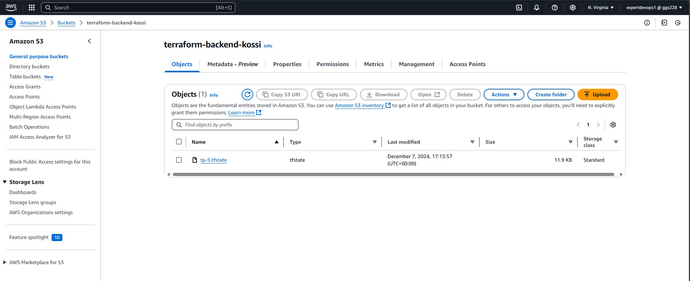
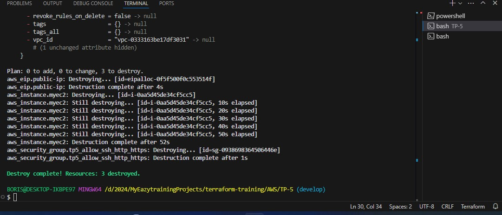

# TERRAFORM-TRAINING

# TP-5 : Remote Backend

> ![Remote Backend] 

# REALISATIONS

## Création du bucket S3
```bash
Amazon S3 -> Create bucket
```
> ![Création du bucket S3] 

> ![Création du bucket S3 (Suite)] 

## Déploiement avec terraform
> ![Terraform init] 

> ![Terraform plan] 

> ![Terraform apply] 

> ![Vérification de l'instance EC2 déployée sur la console AWS] 

> ![Vérification du contenu du bucket S3] 

> ![Terraform destroy] 


