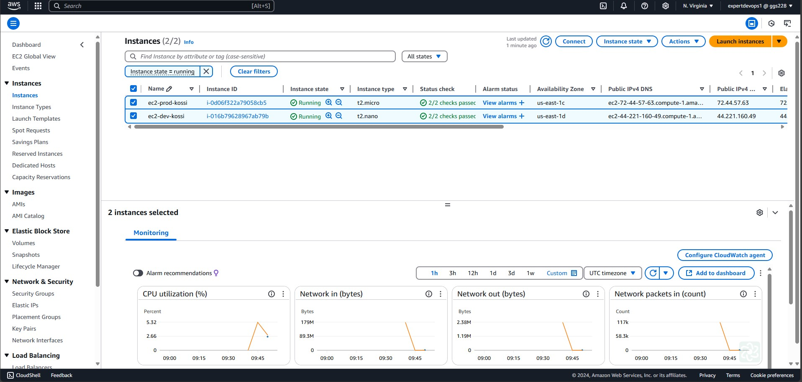

# TERRAFORM-TRAINING

# TP-6 : Module EC2

> ![Module EC2] 

# REALISATIONS ETAPE PAR ETAPE

## MON APPROCHE :  LES OPERATIONS A EFFECTUEES
1. Il faut d'abord commencer par créer le bucket S3 qui va servir de backend pour stocker le fichier terraform.tfstate
2. Créer le module permettant de provisionner l'instance EC2 :
	- Créer un répertoire nommé ***modules*** et y créer à l'intérieur un sous-répertoire nommé ***ec2module*** qui va contenir les fichiers manifests pour le module EC2.
	- Créer un fichier ***variables.tf*** pour variabiliser les éléments nécessaires notamment : le type d'instance,le tag et le groupe de securité
	- Créer un fichier ***main.tf*** qui va contenir l'ensemble des éléments non sensibles notamment : le data source, l'instance EC2, le groupe de sécurité et l'adresse ip publique
3. Créer les différents environnement à provisionner :
	- Pour l'environnement de DEV :
		- Créer un répertoire nommé ***dev*** qui va contenir les fichiers manifests
		- Créer un fichier ***main.tf*** qui va contenir l'ensemble des éléments sensibles (le provider aws et le backend S3) et non sensibles (l'appel du module EC2)
	- Pour l'environnement de PROD :
		- Créer un répertoire nommé ***dev*** qui va contenir les fichiers manifests
		- Créer un fichier ***main.tf*** qui va contenir l'ensemble des éléments sensibles notamment : le provider (aws) et le backend (S3)

## Etape N°1 : Création du bucket S3
```bash
Amazon S3 -> Create bucket
```
> ![Création du bucket S3] 

> ![Création du bucket S3 (Suite)] 

## Etape N°2 : Déploiement de l'environnement de DEV
> ![Etape N°2-1 : Terraform init] 

> ![Etape N°2-2 : Terraform plan] 

> ![Etape N°2-3 : Terraform apply] 

## Etape N°3 : Déploiement de l'environnement de PROD
> ![Etape N°2-1 : Terraform init] 

> ![Etape N°2-2 : Terraform plan] 

> ![Etape N°2-3 : Terraform apply] 

## Etape N°4 : Vérifications des resources déployées
> ![Etape N°4-1 : Vérification des instances EC2 déployées pour les 2 environnements (DEV & PROD)] 

> ![Etape N°4-2 : Vérification du contenu du bucket S3] 

## Etape N°5 : Suppression des resources déployées
> ![Etape N°5-1 : Terraform destroy (DEV)] 
> ![Etape N°5-2 : Terraform destroy (PROD)] 